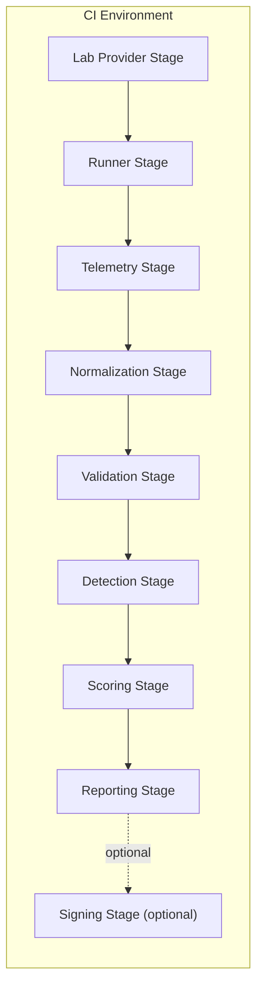

# Purple Axiom

**Ground-truth detection engineering through continuous adversary emulation**

Purple Axiom is a **local-first** cyber range for **isolated lab environments**. It executes safe
adversary-emulation scenarios, captures endpoint telemetry from lab assets, normalizes events into
**OCSF 1.7.0**, evaluates detections using **Sigma**, and produces **deterministic, reproducible run
bundles** suitable for regression testing and trend tracking.

Purple Axiom is specified as a contract-first pipeline: each stage reads inputs from a run bundle
and publishes contract-backed outputs back into the same run bundle. The **filesystem is the
inter-stage contract boundary**.

## Project status and version scope

This repository is **spec-first**. The authoritative behavior is defined by the specification set
under `docs/spec/` and the ADRs under `docs/adr/`.

- **v0.1 (normative):** single-scenario runs, one-shot orchestrator, filesystem-coordinated stages,
  Atomic Red Team execution, endpoint-first telemetry, OCSF normalization, criteria validation,
  Sigma detection evaluation, scoring, and reporting.
- **v0.2+ (reserved or future):** multi-action plans, matrix expansion, and an operator interface /
  appliance model (see `docs/spec/115_operator_interface.md`).

Where this README and the spec set disagree, follow the **spec and ADRs**.

## Why Purple Axiom

Most detection engineering loops still look like: run a test, eyeball logs, and call it “good
enough.” Purple Axiom specifies a repeatable, defensible loop with explicit artifacts you can diff,
gate, and trend:

- **Ground truth:** what ran, when, where, and with what resolved inputs
- **Telemetry:** what was collected (and what was not), including runtime canaries and policy checks
- **Normalization:** how raw events mapped to a portable schema (OCSF), including mapping coverage
- **Validation:** expected vs observed telemetry and cleanup verification (criteria packs)
- **Detections:** what rules were applicable, executable, and what fired (Sigma)
- **Scoring:** coverage, latency, and deterministic gap classification, plus threshold gate inputs
- **Reporting:** a run bundle you can diff, gate in CI, and trend over time
- **Integrity (optional):** checksums/signatures over selected artifacts for tamper evidence

## Core philosophy

Treat detections as theorems you are trying to prove, and adversary emulation as the axioms (ground
truth) you build upon.

This project prioritizes measurable outcomes tied to specific techniques and behaviors, rather than
opaque “security scores.”

## Scope and explicit non-goals

Purple Axiom is designed for isolated lab environments and emphasizes detectability validation
rather than stealth, persistence, or destructive outcomes.

Explicit non-goals for v0.1 include:

- Exploit development, weaponization, destructive testing, or persistence-focused operations
- Production deployment guidance for hostile or multi-tenant environments
- A “full SIEM replacement” or default enterprise ingestion model (external ingestion is optional)
- A full lab provisioning platform (Purple Axiom integrates with external lab providers; it does not
  replace them)
- Automatic endpoint management as a required v0.1 platform feature (agent installation, config
  injection, credential rotation)
- A required long-running daemon, distributed control plane, or built-in scheduler
- Service-to-service RPC as a required coordination mechanism between core pipeline stages
- Required network sensor capture and ingestion as baseline functionality (pcap, NetFlow/IPFIX,
  Zeek, Suricata); placeholder contracts do not imply required implementation
- Network or threat-intelligence enrichment that requires outbound network access by default
- Runtime self-update or “fetch dependencies at execution time” behavior
- Pipeline correctness depending on native container exports (for example EVTX export, PCAP
  retention); any such features require explicit config gates and disclosure semantics

See `docs/spec/010_scope.md` for the authoritative v0.1 scope boundary.

## Safety constraints and secure defaults

Purple Axiom intentionally runs adversary emulation. It MUST be safe to run in a lab and MUST fail
closed when safety controls are violated.

Key constraints:

- The range MUST be operated as an isolated lab, not a production environment.

- Cleanup is required, recorded, and surfaced in reporting and/or validation artifacts.

- Lab assets SHOULD default to an outbound egress-deny posture.

  - Scenario-level network intent is expressed via `scenario.safety.allow_network`.
  - Effective outbound policy is the logical AND of `scenario.safety.allow_network` and
    `security.network.allow_outbound`.
  - Enforcement of outbound posture MUST occur at the lab boundary (provider / lab controls), not as
    a best-effort runner behavior.
  - Unexpected egress is treated as run-fatal and MUST be surfaced as deterministic validation
    evidence.

- Long-term artifacts MUST avoid storing secrets.

  - Redaction is configurable and deterministic.
  - When redaction is disabled, unredacted evidence MUST NOT silently land in standard long-term
    locations; it is either withheld (default) or quarantined under `unredacted/` with explicit
    opt-in and disclosure controls.

- The detection subsystem MUST treat Sigma as non-executable content (no arbitrary code execution).

See `docs/spec/090_security_safety.md` and `docs/adr/ADR-0003-redaction-policy.md` for the
authoritative safety and redaction posture.

## Architecture overview

Purple Axiom v0.1 uses a single-host, local-first topology with a one-shot orchestrator and
file-based stage coordination. Each stage reads inputs from the run bundle and writes outputs back
to the run bundle.

Stages publish via a **publish gate**: outputs are written to staging under the run bundle and then
atomically renamed into their final locations, so downstream stages never observe partially written
directories.

Stable v0.1 stage identifiers are:

1. `lab_provider` resolves target inventory and publishes a deterministic inventory snapshot.
1. `runner` executes scenario actions and emits an append-only ground-truth timeline plus runner
   evidence artifacts.
1. `telemetry` harvests and validates the telemetry collection window and publishes analytics-tier
   raw datasets (and evidence-tier raw preservation when enabled).
1. `normalization` converts raw telemetry into OCSF envelopes with required provenance and
   deterministic event identity, plus mapping coverage artifacts.
1. `validation` applies criteria packs (when enabled) and publishes validation results, including
   cleanup verification results surfaced from runner evidence.
1. `detection` compiles and evaluates Sigma against normalized events via the Sigma-to-OCSF bridge.
1. `scoring` produces coverage, latency, and gap metrics, plus threshold gate inputs.
1. `reporting` emits human-readable and machine-readable report outputs for diffing, trending, and
   CI gating.
1. `signing` (optional) emits integrity artifacts for selected run bundle content.

Note: Telemetry collection may run concurrently with the runner (collectors are typically started
before `runner` begins and stopped after it completes). The `telemetry` stage boundary refers to the
post-run harvest/validation/publish step that materializes `raw_parquet/**` for downstream stages.

For the authoritative v0.1 topology and IO boundaries, see
`docs/adr/ADR-0004-deployment-architecture-and-inter-component-communication.md`.



## Range lifecycle verbs

The orchestrator may expose a small set of stable range lifecycle verbs (entry points) that map to
deterministic subsets of stages. In v0.1, only `simulate` is required for completeness; other verbs
may exist as an interface surface when implemented.

Common invariants (v0.1):

- Every verb invocation targets exactly one run bundle (`runs/<run_id>/`) and MUST acquire the run
  lock (atomic create of `runs/.locks/<run_id>.lock`) before creating or mutating run-bundle
  artifacts (including `manifest.json`).
- Any verb that writes contract-backed artifacts MUST follow publish-gate semantics
  (`.staging/<stage_id>/` then atomic publish).

Verb mapping (v0.1):

- `build`: inventory resolution only (`lab_provider`).
- `simulate`: canonical v0.1 stage sequence (`lab_provider` → `runner` → `telemetry` →
  `normalization` → `validation` → `detection` → `scoring` → `reporting` → optional `signing`).
- `replay`: downstream-only recomputation from existing telemetry datasets (`normalization` →
  `validation` → `detection` → `scoring` → `reporting` → optional `signing`).
- `export`: package run bundles for sharing (policy-controlled; excludes `unredacted/**` by
  default).
- `destroy`: clean up run-local resources and (optionally) tear down lab resources (explicit
  enable).

Authoritative definition: `docs/spec/020_architecture.md`.

## Key concepts

- **Scenario:** a planned set of actions/tests executed by the runner.

- **Action:** a single scenario step with a run-scoped `action_id` and a stable join key for
  cross-run comparisons.

- **Run:** a single execution instance with a unique `run_id` (UUID, canonical hyphenated form).

- **Run bundle:** the on-disk artifact bundle rooted at `runs/<run_id>/`, indexed by
  `manifest.json`.

- **Inventory snapshot:** a deterministic snapshot of resolved lab targets, written per run
  (recommended: `logs/lab_inventory_snapshot.json`).

- **Ground truth:** append-only timeline of what executed, with expected-observability hints and
  runner evidence.

- **Normalized events:** OCSF envelopes with required provenance fields and deterministic event
  identity (`metadata.event_id`).

- **Mapping profile:** deterministic mapping definition used by the normalizer; inputs and results
  are snapshotted for reproducibility.

- **Criteria pack:** validation rules that evaluate expected vs observed telemetry and cleanup
  state.

- **Sigma evaluation:** compilation and execution of Sigma rules against normalized OCSF events via
  the Sigma-to-OCSF bridge.

- **Stage outcome:** per-stage deterministic outcome metadata:

  - `status`: `success | failed | skipped`
  - `fail_mode`: `fail_closed | warn_and_skip`
  - `reason_code`: stable token for CI gating and triage

- **Evidence reference:** deterministic pointer to a run-relative artifact (and optionally a
  selector within it) used to justify a conclusion or gate.

- **Run status:** overall status derived from recorded stage outcomes
  (`success | partial | failed`).

## Run bundles

Each run produces a run bundle at `runs/<run_id>/`. The **manifest** (`manifest.json`) is the
authoritative index of what exists, which versions/config hashes were used, and the derived overall
run status.

### Normative top-level layout (v0.1)

The run bundle layout is contract-driven. At a high level, you should expect:

```text
runs/<run_id>/
  manifest.json
  ground_truth.jsonl

  inputs/                      # operator inputs (read-only) + regression baseline references (when enabled)
    baseline_run_ref.json      # required when regression compare is enabled
    baseline/                  # optional, recommended snapshot (for example baseline manifest bytes)

  runner/                      # runner evidence: per-action artifacts, ledgers, cleanup verification
    actions/<action_id>/...
    principal_context.json     # optional run-level evidence (when enabled)

  raw_parquet/                 # analytics tier: structured raw telemetry tables (Parquet)
  raw/                         # evidence tier: source-native payloads/blobs (when enabled)

  normalized/                  # analytics tier: normalized OCSF event store + mapping coverage
  criteria/                    # criteria pack snapshot + criteria evaluation outputs (when enabled)

  bridge/                      # Sigma→OCSF bridge artifacts: mapping pack snapshot, compiled plans, coverage
  detections/                  # detection outputs (Sigma evaluation results)

  scoring/                     # summary metrics + deterministic gap classification
  report/                      # report outputs (required: report/report.json, report/thresholds.json)

  logs/                        # operability and deterministic failure triage surfaces
    health.json                # optional stage/substage outcomes mirror (when enabled)
    telemetry_validation.json  # telemetry validation evidence (when enabled)
    lab_inventory_snapshot.json
    contract_validation/       # contract validation reports (emitted on publish-gate failure)
    cache_provenance.json      # emitted when caching can influence outputs (when enabled)

  security/                    # signing + integrity artifacts (when enabled) and policy snapshots
  unredacted/                  # optional quarantine (explicit opt-in; excluded from exports by default)

  .staging/                    # publish-gate staging dirs (internal; excluded from exports; may be absent)
  plan/                        # reserved (v0.2+)
```

Notes:

- `logs/` is an operability surface. Some files under `logs/` are reproducibility-critical (for
  example `logs/lab_inventory_snapshot.json`, telemetry validation evidence, and contract validation
  reports) and are expected to be retained with the run bundle.
- `.staging/**` is an internal publish-gate mechanism and MUST NOT be included in long-term exports.
- `runs/.locks/<run_id>.lock` is a lock primitive and is not part of any run bundle.

### Storage formats and determinism

Purple Axiom uses a two-tier storage model:

- **Evidence tier** preserves source-native artifacts when they are valuable for fidelity and
  reprocessing (under `raw/**` and `runner/**`).
- **Analytics tier** stores structured, queryable datasets for evaluation and trending (Parquet
  under `raw_parquet/**` and `normalized/**`).

Format expectations:

- Small, contract-driven artifacts are JSON (for example `manifest.json`, `scoring/summary.json`,
  and `report/report.json`).
- Event-like streams are JSONL when line-addressable diffs/fixtures are required (for example
  `ground_truth.jsonl` and `detections/detections.jsonl`).
- Long-term event streams and large datasets are Parquet by default (for example the normalized OCSF
  event store).

Determinism expectations:

- Contracted artifacts use deterministic paths (no timestamped contracted filenames).
- Contract validation uses local-only JSON Schema reference resolution (no network fetches) and
  deterministic error ordering.
- Any cache that can influence outputs is explicitly gated and must be observable (for example via
  `logs/cache_provenance.json`).

Authoritative references:

- `docs/spec/025_data_contracts.md`
- `docs/spec/045_storage_formats.md`
- `docs/adr/ADR-0002-event-identity-and-provenance.md`

## Status model and CI posture

Purple Axiom is specified to fail closed on contract violations and to expose deterministic outcomes
for CI and regression gating.

### Stage outcomes and run status derivation

- Each enabled stage records a deterministic stage outcome in `manifest.json` (and in
  `logs/health.json` when enabled).

- Run status (`manifest.status`) is derived deterministically from recorded stage outcomes:

  - `failed`: any stage failed with `fail_mode=fail_closed`
  - `partial`: otherwise, any stage failed with `fail_mode=warn_and_skip`
  - `success`: otherwise

### CI integration (reporting)

The reporting stage emits a CI-facing recommendation and exit code:

- exit `0`: success
- exit `10`: partial (artifacts usable but gates failed)
- exit `20`: failed (artifacts not usable)

CI workflows can gate on `report/thresholds.json.status_recommendation`.

Authoritative references:

- `docs/adr/ADR-0005-stage-outcomes-and-failure-classification.md`
- `docs/spec/080_reporting.md`
- `docs/spec/105_ci_operational_readiness.md`

## Evidence references and gap attribution

Whenever Purple Axiom degrades status or claims a gap (telemetry missing, normalization gap, Sigma
compile failure, etc.), the corresponding outputs are expected to include explicit evidence
references pointing to run artifacts that justify the conclusion.

Evidence references are run-relative and deterministic:

- `artifact_path` (required): run-relative POSIX path
- `selector` (optional): selector within the artifact (for example a JSON Pointer or JSONL line)
- `handling` (optional): `present | withheld | quarantined | absent`

This ensures that “why did this gate fail?” is answered by stable pointers to artifacts that can be
reviewed and diffed.

## Configuration

Purple Axiom is configured via `range.yaml` (see the normative configuration reference).
Configuration and contract validation are first-class parts of the runtime and CI model.

- Canonical keys, defaults, and examples: `docs/spec/120_config_reference.md`

- Operational limits, safety toggles, redaction posture, and network isolation policy:

  - `docs/spec/090_security_safety.md`
  - `docs/adr/ADR-0003-redaction-policy.md`

## Documentation

### Getting oriented (recommended reading order)

1. `docs/spec/000_charter.md` (what the project is and why it exists)
1. `docs/spec/010_scope.md` (scope, non-goals, operating assumptions)
1. `docs/spec/020_architecture.md` (stage model, verbs, run bundle layout)
1. `docs/spec/025_data_contracts.md` (schemas, publish gates, determinism rules)
1. `docs/spec/120_config_reference.md` (what you can configure and how)

### Primary specs

| Spec                         | File                                                    |
| ---------------------------- | ------------------------------------------------------- |
| Charter                      | `docs/spec/000_charter.md`                              |
| Scope and non-goals          | `docs/spec/010_scope.md`                                |
| Lab providers                | `docs/spec/015_lab_providers.md`                        |
| Architecture                 | `docs/spec/020_architecture.md`                         |
| Data contracts               | `docs/spec/025_data_contracts.md`                       |
| Scenario model               | `docs/spec/030_scenarios.md`                            |
| Plan execution model         | `docs/spec/031_plan_execution_model.md`                 |
| Atomic executor integration  | `docs/spec/032_atomic_red_team_executor_integration.md` |
| Validation criteria          | `docs/spec/035_validation_criteria.md`                  |
| Telemetry pipeline           | `docs/spec/040_telemetry_pipeline.md`                   |
| osquery integration          | `docs/spec/042_osquery_integration.md`                  |
| Unix log ingestion           | `docs/spec/044_unix_log_ingestion.md`                   |
| Storage formats              | `docs/spec/045_storage_formats.md`                      |
| OCSF normalization           | `docs/spec/050_normalization_ocsf.md`                   |
| OCSF field tiers             | `docs/spec/055_ocsf_field_tiers.md`                     |
| Sigma detection model        | `docs/spec/060_detection_sigma.md`                      |
| Sigma-to-OCSF bridge         | `docs/spec/065_sigma_to_ocsf_bridge.md`                 |
| Scoring and metrics          | `docs/spec/070_scoring_metrics.md`                      |
| Reporting                    | `docs/spec/080_reporting.md`                            |
| Security and safety          | `docs/spec/090_security_safety.md`                      |
| Test strategy and CI         | `docs/spec/100_test_strategy_ci.md`                     |
| CI and operational readiness | `docs/spec/105_ci_operational_readiness.md`             |
| Operability                  | `docs/spec/110_operability.md`                          |
| Operator interface (v0.2+)   | `docs/spec/115_operator_interface.md`                   |
| Configuration reference      | `docs/spec/120_config_reference.md`                     |

### Data contracts and schemas

- Contract registry (authoritative index): `docs/contracts/contract_registry.json`
- Contract schemas (Draft 2020-12): `docs/contracts/*.schema.json`
- Contract versioning and publish-gate validation: `docs/spec/025_data_contracts.md`

### Mapping profiles and coverage

| Document                                 | File                                                    |
| ---------------------------------------- | ------------------------------------------------------- |
| Mapping profile authoring guide          | `docs/mappings/ocsf_mapping_profile_authoring_guide.md` |
| Coverage matrix (sources x OCSF classes) | `docs/mappings/coverage_matrix.md`                      |
| Windows Sysmon mapping profile           | `docs/mappings/windows-sysmon_to_ocsf_1.7.0.md`         |
| Windows Security mapping profile         | `docs/mappings/windows-security_to_ocsf_1.7.0.md`       |
| Linux auditd mapping profile             | `docs/mappings/linux-auditd_to_ocsf_1.7.0.md`           |
| osquery mapping profile                  | `docs/mappings/osquery_to_ocsf_1.7.0.md`                |

### ADRs

| ADR                                                                              | Decision area                                             |
| -------------------------------------------------------------------------------- | --------------------------------------------------------- |
| `docs/adr/ADR-0001-project-naming-and-versioning.md`                             | Project naming rules and versioning policy                |
| `docs/adr/ADR-0002-event-identity-and-provenance.md`                             | Event identity, provenance model, and determinism rules   |
| `docs/adr/ADR-0003-redaction-policy.md`                                          | Redaction policy posture and consequences                 |
| `docs/adr/ADR-0004-deployment-architecture-and-inter-component-communication.md` | Deployment architecture and inter-component communication |
| `docs/adr/ADR-0005-stage-outcomes-and-failure-classification.md`                 | Stage outcomes and failure classification rules           |
| `docs/adr/ADR-0006-plan-execution-model.md`                                      | Plan execution model and reserved multi-target semantics  |
| `docs/adr/ADR-0007-state-machines.md`                                            | Lifecycle state machines for stages and publish gates     |

## Requirements

- Isolated lab environment (required)

- Python 3.12.3 (pinned; see `SUPPORTED_VERSIONS.md` for toolchain and dependency details)

- Dependency pins as specified in `SUPPORTED_VERSIONS.md` (non-exhaustive highlights):

  - OpenTelemetry Collector Contrib 0.143.1
  - pySigma 1.1.0
  - pySigma-pipeline-ocsf 0.1.1
  - pyarrow 22.0.0
  - jsonschema 4.26.0
  - osquery 5.14.1 (for lab endpoints)
  - OCSF schema 1.7.0 (normalization target)
  - PowerShell 7.4.6 (for Atomic executor)

- Optional packaging: Docker Compose MAY be provided for installation convenience, but it is not a
  normative requirement for v0.1

## License

MIT License. See `LICENSE`.

## Contributing

See `CONTRIBUTING.md`. Contributions should preserve:

- deterministic outputs
- contract-first artifacts
- safe-by-default scenario execution
- clear provenance and reproducibility metadata
