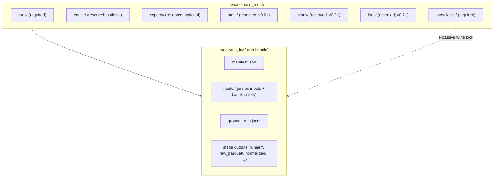
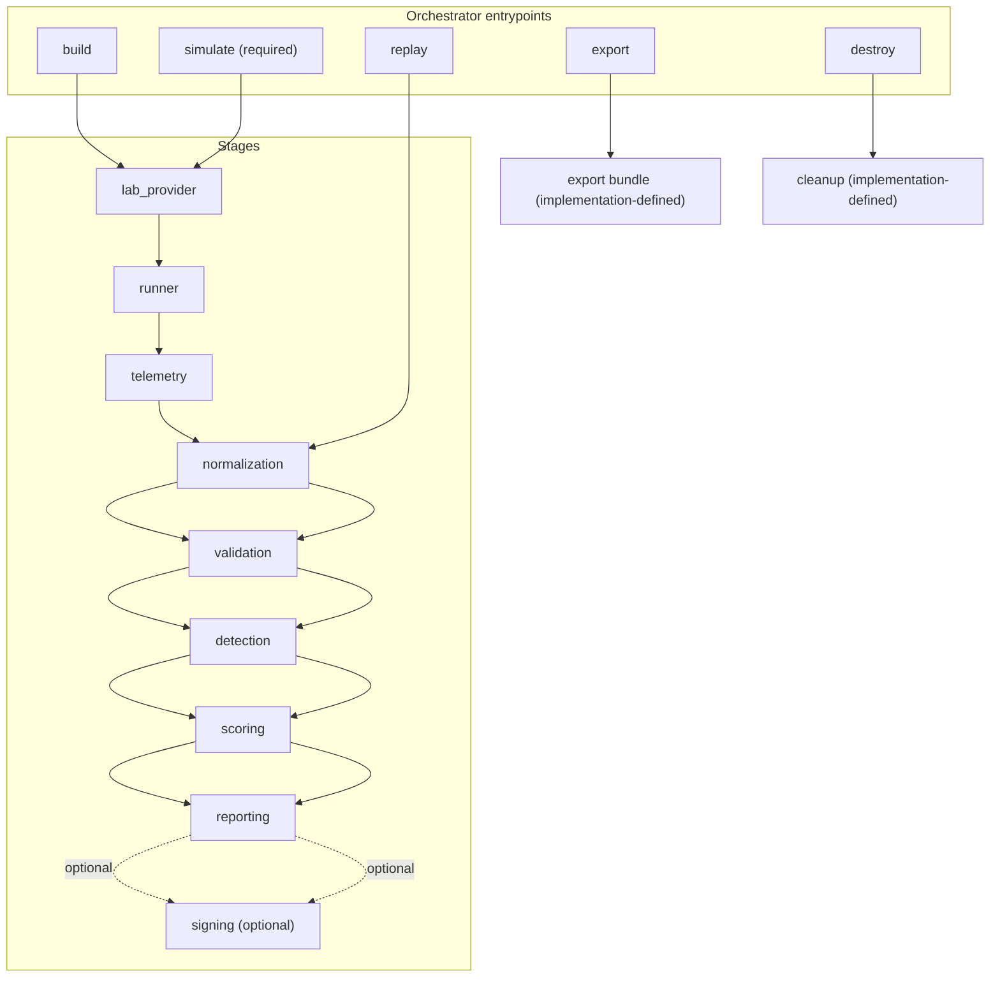

# Purple Axiom

**Ground-truth detection engineering through continuous adversary emulation**

Purple Axiom is a **local-first** cyber range for **isolated lab environments**. It executes safe
adversary-emulation scenarios, captures endpoint telemetry from lab assets, normalizes events into
**OCSF 1.7.0**, evaluates detections using **Sigma**, and produces **deterministic, reproducible run
bundles** suitable for regression testing and trend tracking.

This repository is **spec-first**. The authoritative behavior is defined by the specification set
under `docs/spec/` and the ADRs under `docs/adr/`. Where this README and the spec set disagree,
follow the **specs and ADRs**.

## Part 1: Executive summary

### What this project does

Purple Axiom defines a repeatable, defensible detection-engineering loop with explicit artifacts you
can diff, gate, and trend over time:

- **Ground truth**: what ran, when, where, and with what resolved inputs
- **Telemetry**: what was collected (and what was not), including runtime canaries and policy checks
- **Normalization**: how raw events map into OCSF, including mapping coverage
- **Validation**: expected vs observed telemetry and cleanup verification (criteria packs)
- **Detections**: what rules were applicable/executable and what fired (Sigma)
- **Scoring**: coverage, latency, and deterministic gap classification with threshold gate inputs
- **Reporting**: a run bundle you can diff, gate in CI, and trend over time
- **Integrity (optional)**: checksums and signatures over selected artifacts for tamper evidence

### Why it exists

Most detection engineering loops still look like “run a test, eyeball logs, call it good enough.”

Purple Axiom replaces that with a **contract-backed** pipeline where each stage reads its inputs
from the **run bundle** and publishes schema-validated outputs back into the same run bundle. The
**filesystem is the inter-stage contract boundary**.

### Core philosophy

Treat detections as theorems you are trying to prove, and adversary emulation as the axioms (ground
truth) you build upon.

### Who it is for

- Detection engineers validating visibility and detection logic
- SOC analysts validating investigative pivots and alert quality
- Purple teams and continuous security testing operators running unattended lab workflows

### What it is not

Purple Axiom is designed for isolated lab environments and emphasizes detectability validation
rather than stealth, persistence, or destructive outcomes.

Explicit non-goals for v0.1 include:

- Exploit development, weaponization, destructive testing, or persistence-focused operations
- Production deployment guidance for hostile or multi-tenant environments
- A “full SIEM replacement” or default enterprise ingestion model (external ingestion is optional)
- A full lab provisioning platform (Purple Axiom integrates with external lab providers; it does not
  replace them)
- Automatic endpoint management as a required v0.1 platform feature (agent installation, config
  injection, credential rotation)
- A required long-running daemon, distributed control plane, or built-in scheduler
- Service-to-service RPC as a required coordination mechanism between core pipeline stages
- Required network sensor capture and ingestion as baseline functionality (pcap, NetFlow/IPFIX,
  Zeek, Suricata)
- Network or threat-intelligence enrichment that requires outbound network access by default
- Runtime self-update or “fetch dependencies at execution time” behavior
- Pipeline correctness depending on native container exports (any such features require explicit
  config gates and disclosure semantics)

Authoritative v0.1 scope boundary: `docs/spec/010_scope.md`.

### Project status and version scope

- **v0.1 (normative):** single-scenario runs, one-shot orchestrator, filesystem-coordinated stages,
  Atomic Red Team execution, endpoint-first telemetry, OCSF normalization, criteria validation,
  Sigma detection evaluation, scoring, reporting, and optional signing.
- **v0.2+ (reserved / future):** multi-action plans, matrix expansion, threat-intel inputs, and an
  operator interface / appliance model (see `docs/spec/115_operator_interface.md` and ADR-0006).

### Safety constraints and secure defaults

Purple Axiom intentionally runs adversary emulation. It MUST be safe to run in a lab and MUST fail
closed when safety controls are violated.

Key constraints:

- The range MUST be operated as an **isolated lab**, not a production environment.

- Cleanup is required, recorded, and surfaced in reporting and/or validation artifacts.

- Lab assets SHOULD default to an outbound egress-deny posture:

  - Scenario-level network intent is expressed via `scenario.safety.allow_network`.
  - Effective outbound policy is the logical AND of `scenario.safety.allow_network` and
    `security.network.allow_outbound`.
  - Enforcement MUST occur at the lab boundary (provider / lab controls), not as best-effort runner
    behavior.
  - Unexpected egress is treated as run-fatal and MUST be surfaced as deterministic validation
    evidence.

- Long-term artifacts MUST avoid storing secrets:

  - Redaction is configurable and deterministic.
  - When redaction is disabled, unredacted evidence MUST NOT silently land in standard long-term
    locations. It is either withheld (default) or quarantined under `unredacted/` with explicit
    opt-in and disclosure controls.

- The detection subsystem MUST treat Sigma as **non-executable content** (no arbitrary code
  execution).

Authoritative references: `docs/spec/090_security_safety.md` and
`docs/adr/ADR-0003-redaction-policy.md`.

## Part 2: Architectural overview

### Topology and coordination model

Purple Axiom v0.1 uses a single-host, local-first topology with a one-shot orchestrator and
**file-based stage coordination**.

- Each run produces one run bundle at `runs/<run_id>/`.

- Each stage reads inputs from the run bundle and publishes outputs back to the run bundle.

- The orchestrator is responsible for acquiring a per-run lock and for recording stage outcomes in
  the run manifest.

- Stages publish via a **publish gate**:

  - write outputs to `runs/<run_id>/.staging/<stage_id>/`
  - validate contract-backed outputs against local schemas
  - atomically promote staged outputs into their final run-bundle locations

#### Workspace root boundary (v0.1+)

The workspace root is the directory that contains `runs/`. Only reserved workspace directories may
be written outside a run bundle (for example `runs/.locks/`, and optionally `cache/` and
`exports/`).



Authoritative reference: `docs/spec/020_architecture.md` ("Workspace layout (v0.1+ normative)").

### Pipeline stages (v0.1)

Stable v0.1 stage identifiers:

1. `lab_provider` resolves target inventory and publishes a deterministic inventory snapshot.
1. `runner` executes scenario actions and emits an append-only ground-truth timeline plus runner
   evidence artifacts.
1. `telemetry` harvests and validates the telemetry collection window and publishes analytics-tier
   raw datasets (and evidence-tier raw preservation when enabled).
1. `normalization` converts raw telemetry into OCSF envelopes with required provenance and
   deterministic event identity, plus mapping coverage artifacts.
1. `validation` applies criteria packs (when enabled) and publishes validation results, including
   cleanup verification results surfaced from runner evidence.
1. `detection` compiles and evaluates Sigma against normalized events via the Sigma-to-OCSF bridge.
1. `scoring` produces coverage, latency, and gap metrics, plus threshold gate inputs.
1. `reporting` emits human-readable and machine-readable report outputs for diffing, trending, and
   CI gating.
1. `signing` (optional) emits integrity artifacts for selected run bundle content.

Note: telemetry collection MAY run concurrently with the runner. The `telemetry` stage boundary
refers to the post-run harvest/validation/publish step that materializes `raw_parquet/**` for
downstream stages.


Authoritative topology and IO boundaries:
`docs/adr/ADR-0004-deployment-architecture-and-inter-component-communication.md`.

### Range lifecycle verbs (entrypoints)

The orchestrator MAY expose stable lifecycle verbs (entrypoints) that map to deterministic subsets
of stages. In v0.1, `simulate` is the only verb required for completeness; other verbs are allowed
interface surfaces when implemented.

Common invariants (v0.1):

- Every verb invocation targets exactly one run bundle and MUST acquire the run lock
  (`runs/.locks/<run_id>.lock`) before mutating run-bundle artifacts.
- Operator inputs are pinned under `runs/<run_id>/inputs/` (at minimum `inputs/range.yaml` and
  `inputs/scenario.yaml`) before the first stage runs.
- Any verb that writes contract-backed artifacts MUST use publish-gate semantics
  (`.staging/<stage_id>/` then atomic publish).

Verb mapping (v0.1):

- `build`: inventory resolution and input pinning (`lab_provider`).
- `simulate`: canonical stage sequence (`lab_provider` → `runner` → `telemetry` → `normalization` →
  `validation` → `detection` → `scoring` → `reporting` → optional `signing`).
- `replay`: downstream recomputation from existing datasets (default: `normalization` → `validation`
  → `detection` → `scoring` → `reporting` → optional `signing`).
- `export`: package run bundles for sharing (policy-controlled; excludes `unredacted/**` by
  default).
- `destroy`: clean up run-local resources and optionally tear down lab resources (explicit enable
  required).



Authoritative definition: `docs/spec/020_architecture.md` ("Range lifecycle verbs (v0.1; normative
where stated)").

### Publish gate semantics (why downstream never sees partial outputs)

The publish gate is the contract and crash-safety boundary between stages:

- Stages write outputs under `.staging/<stage_id>/`
- Contract-backed outputs are validated against local schemas
- Outputs are atomically promoted into final paths
- Stage outcomes are recorded deterministically (status, fail_mode, reason_code)


Authoritative references: `docs/spec/025_data_contracts.md` (publish-gate validation) and
`docs/adr/ADR-0007-state-machines.md` (lifecycle FSM template).

## Part 3: Details of interest

### Determinism and reproducibility (what makes this “diffable”)

Purple Axiom treats determinism as a first-class requirement:

- **Deterministic paths** for contracted artifacts (no timestamped contracted filenames).

- **Deterministic ordering** for lists and streams that affect diffs and regression fixtures.

- **Canonicalization** for identity keys:

  - action join keys are based on RFC 8785 (JCS) canonical JSON for stable hashes

- **Deterministic event identity**:

  - normalized events carry stable `metadata.event_id` values for cross-stage joins

- **Cache transparency**:

  - any cache that can influence outputs is explicitly gated and must be observable (for example via
    `logs/cache_provenance.json`)

### Stage outcomes and run status model

Each enabled stage records a deterministic outcome in `manifest.json` (and optionally
`logs/health.json`):

- `status`: `success | failed | skipped`
- `fail_mode`: `fail_closed | warn_and_skip`
- `reason_code`: stable token for CI gating and triage

Run status (`manifest.status`) is derived deterministically from recorded outcomes:

- `failed`: any stage failed with `fail_mode=fail_closed`
- `partial`: otherwise, any stage failed with `fail_mode=warn_and_skip`
- `success`: otherwise

### CI posture (reporting as the CI interface)

The reporting stage emits a CI-facing recommendation and exit code:

- exit `0`: success
- exit `10`: partial (artifacts usable but quality gates failed or were indeterminate)
- exit `20`: failed (artifacts not mechanically usable)

CI workflows can gate on `report/thresholds.json.status_recommendation`.

Authoritative references: `docs/adr/ADR-0005-stage-outcomes-and-failure-classification.md`,
`docs/spec/080_reporting.md`, `docs/spec/105_ci_operational_readiness.md`.

### OCSF field tiers and a practical coverage gate

Normalization targets OCSF 1.7.0. Tiered field expectations provide a measurable quality signal
without turning “SHOULD-level” schema expectations into hard failures.

In v0.1, scoring defines a normalization coverage gate based on **Tier 1 (Core Common)** field
coverage that can downgrade a run to `partial` when coverage is below threshold or indeterminate
(for example no events). See:

- `docs/spec/055_ocsf_field_tiers.md`
- `docs/spec/070_scoring_metrics.md` (Tier 1 coverage gate)

### Export and signing scope (especially `logs/`)

`runs/<run_id>/logs/` is intentionally mixed:

- Some `logs/**` artifacts are **deterministic evidence** required for reproducibility and CI
  gating.
- Other `logs/**` artifacts are **volatile diagnostics** that are not required for reproducibility
  and may be sensitive.

Default export and signing/checksum scope MUST:

- include deterministic evidence logs, and
- exclude volatile diagnostics,
- exclude `.staging/**`,
- exclude `unredacted/**` unless explicitly requested and permitted.

Deterministic evidence logs allowlist (included when present):

- `logs/health.json`
- `logs/telemetry_validation.json` (when enabled)
- `logs/counters.json`
- `logs/cache_provenance.json` (when caching is enabled)
- `logs/lab_inventory_snapshot.json`
- `logs/lab_provider_connectivity.json` (optional; when implemented)
- `logs/contract_validation/**`

Volatile diagnostics (excluded by default) include:

- `logs/run.log`
- `logs/warnings.jsonl`
- `logs/telemetry_checkpoints/**`
- `logs/dedupe_index/**`
- `logs/scratch/**`
- and any other `logs/**` path not allowlisted as deterministic evidence

Authoritative reference: `docs/adr/ADR-0009-run-export-policy-and-log-classification.md` and
`docs/spec/045_storage_formats.md` (Tier 0 classification).

### Evidence references and “why did this gate fail?”

Whenever Purple Axiom degrades status or claims a gap (telemetry missing, normalization gap, Sigma
compile failure, etc.), outputs are expected to include explicit evidence references:

- `artifact_path` (required): run-relative POSIX path
- `selector` (optional): selector within the artifact (for example JSON Pointer or JSONL line
  selector)
- `handling` (optional): `present | withheld | quarantined | absent`

This ensures CI and operators can answer “why?” using stable pointers to run artifacts that can be
reviewed and diffed.

## Part 4: Run bundles, artifacts, and where to look

Each run produces a run bundle at `runs/<run_id>/`. The **manifest** (`manifest.json`) is the
authoritative index of what exists, which versions/config hashes were used, and the derived overall
run status.

### Run bundle layout (high level)

```text
runs/<run_id>/
  manifest.json
  ground_truth.jsonl

  inputs/                         # pinned operator inputs; baseline refs when regression is enabled
    range.yaml
    scenario.yaml
    baseline_run_ref.json         # required when regression compare is enabled
    baseline/                     # optional snapshot form (recommended)
      manifest.json

  runner/                         # runner evidence: per-action artifacts, ledgers, cleanup verification
    actions/<action_id>/...
    principal_context.json        # optional (policy-controlled)

  raw_parquet/                    # analytics tier: structured raw telemetry tables (Parquet)
  raw/                            # evidence tier: source-native payloads/blobs (optional; policy-controlled)

  normalized/                     # normalized OCSF event store + mapping coverage
    ocsf_events/                  # preferred representation (Parquet dataset)
    ocsf_events.jsonl             # alternate representation (JSONL); MUST NOT coexist with dataset form
    mapping_profile_snapshot.json
    mapping_coverage.json

  criteria/                       # criteria pack snapshot + criteria evaluation outputs (when enabled)
    criteria.jsonl
    results.jsonl

  bridge/                         # Sigma→OCSF bridge artifacts: mapping pack snapshot, compiled plans, coverage
  detections/                     # detection outputs (Sigma evaluation results)
    detections.jsonl

  scoring/                        # summary metrics + deterministic gap classification
    summary.json

  report/                         # report outputs (required: report.json, thresholds.json)
    report.json
    thresholds.json
    run_timeline.md

  logs/                           # deterministic evidence logs + volatile diagnostics (see ADR-0009)
    health.json                   # optional (when enabled)
    telemetry_validation.json     # optional (when enabled)
    counters.json                 # stable counters surface
    lab_inventory_snapshot.json
    contract_validation/

  security/                       # checksums/signatures + policy snapshots (when enabled)
  unredacted/                     # optional quarantine (explicit opt-in; excluded from exports by default)

  .staging/                       # internal publish-gate staging dirs (excluded from exports; may be absent)
  plan/                           # reserved (v0.2+)
```

Notes:

- `.staging/**` is internal scratch space and MUST NOT be included in long-term exports.

- `runs/.locks/<run_id>.lock` is a lock primitive and is not part of any run bundle.

- The normalized OCSF store has multiple allowed representations:

  - `normalized/ocsf_events/` (Parquet dataset) is preferred
  - `normalized/ocsf_events.jsonl` (JSONL) is an alternate representation
  - if both exist, consumers must fail closed

### “I want X, where is it?” (common entry points)

| Goal                                                                | Start with                       | Then                                                                                    |
| ------------------------------------------------------------------- | -------------------------------- | --------------------------------------------------------------------------------------- |
| Determine overall run health and why it is `success/partial/failed` | `manifest.json`                  | `report/thresholds.json`, `logs/health.json` (if enabled), evidence refs inside outputs |
| See what actually ran (ground truth)                                | `ground_truth.jsonl`             | `runner/actions/<action_id>/...` evidence and ledgers                                   |
| Inspect telemetry collection validity and canary results            | `logs/telemetry_validation.json` | `raw_parquet/**` datasets                                                               |
| Query normalized events (OCSF)                                      | `normalized/ocsf_events/`        | `normalized/mapping_coverage.json`, `normalized/mapping_profile_snapshot.json`          |
| See which detections fired and why                                  | `detections/detections.jsonl`    | `bridge/**` compiled plans and coverage                                                 |
| Use the machine-readable scorecard                                  | `scoring/summary.json`           | `report/report.json` (presentation + rollups)                                           |
| CI gating result and thresholds                                     | `report/thresholds.json`         | exit code mapping in reporting spec                                                     |

## Part 5: Configuration

Purple Axiom is configured via `range.yaml` (the normative configuration reference). For each run,
the orchestrator pins effective inputs into the run bundle under `inputs/` (for reproducibility), at
minimum:

- `inputs/range.yaml`
- `inputs/scenario.yaml`

Configuration and contract validation are first-class parts of the runtime and CI model:

- Canonical keys, defaults, and examples: `docs/spec/120_config_reference.md`

- Safety toggles, redaction posture, secrets-by-reference rules, and outbound policy:

  - `docs/spec/090_security_safety.md`
  - `docs/adr/ADR-0003-redaction-policy.md`

## Part 6: Documentation map

### Getting oriented (recommended reading order)

1. `docs/spec/000_charter.md` (what the project is and why it exists)
1. `docs/spec/010_scope.md` (scope, non-goals, operating assumptions)
1. `docs/spec/020_architecture.md` (stage model, verbs, workspace and run bundle layout)
1. `docs/spec/025_data_contracts.md` (schemas, publish gates, determinism rules)
1. `docs/spec/120_config_reference.md` (what you can configure and how)

### Primary specs and ADRs

See the tables in this repository under:

- `docs/spec/` for stage and pipeline specifications
- `docs/adr/` for architectural decisions and normative policy clarifications

## Part 7: Requirements and pinned versions (v0.1)

- Isolated lab environment (required)

- Python **3.12.3** (pinned; see `SUPPORTED_VERSIONS.md`)

- External dependency pins (authoritative list in `SUPPORTED_VERSIONS.md`), including:

  - OpenTelemetry Collector Contrib **0.143.1**
  - pySigma **1.1.0**
  - pySigma-pipeline-ocsf **0.1.1**
  - PCRE2 (libpcre2-8) **10.47**
  - pyarrow **22.0.0**
  - jsonschema **4.26.0**
  - osquery **5.14.1** (for lab endpoints)
  - OCSF schema **1.7.0**
  - PowerShell **7.4.6** (Atomic executor)
  - DSC v3 (`dsc`) **3.1.2** (runner environment configuration when enabled)
  - asciinema **2.4.0** (runner terminal session recording when enabled)

Optional packaging: Docker Compose MAY be provided for installation convenience, but it is not a
normative requirement for v0.1.

## Part 8: License

MIT License. See `LICENSE`.

## Part 9: Contributing

See `CONTRIBUTING.md`. Contributions should preserve:

- deterministic outputs
- contract-first artifacts and publish-gate validation
- safe-by-default scenario execution
- clear provenance and reproducibility metadata
