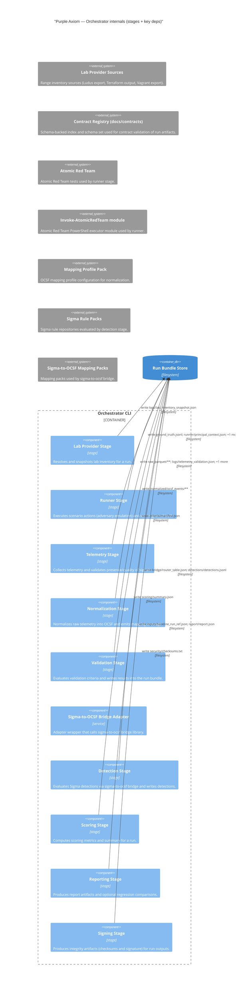

# Purple Axiom — C4 Component (Orchestrator Internals)

```mermaid
C4Component
title "Purple Axiom — Orchestrator internals (stages + key deps)"
System_Ext(lab_provider_sources, "Lab Provider Sources", "Range inventory sources (Ludus export, Terraform output, Vagrant export).")
System_Ext(contract_registry, "Contract Registry (docs/contracts)", "Schema-backed index and schema set used for contract validation of run artifacts.")
System_Ext(atomic_red_team, "Atomic Red Team", "Atomic Red Team tests used by runner stage.")
System_Ext(invoke_atomic_red_team, "Invoke-AtomicRedTeam module", "Atomic Red Team PowerShell executor module used by runner.")
System_Ext(mapping_profile_pack, "Mapping Profile Pack", "OCSF mapping profile configuration for normalization.")
System_Ext(sigma_rule_packs, "Sigma Rule Packs", "Sigma rule repositories evaluated by detection stage.")
System_Ext(sigma_to_ocsf_mapping_packs, "Sigma-to-OCSF Mapping Packs", "Mapping packs used by sigma-to-ocsf bridge.")
ContainerDb(run_bundle_store, "Run Bundle Store", "filesystem", "")
Container_Boundary(orchestrator_cli, "Orchestrator CLI") {
  Component(lab_provider, "Lab Provider Stage", "stage", "Resolves and snapshots lab inventory for a run.")
  Component(runner, "Runner Stage", "stage", "Executes scenario actions (adversary emulation) and writes ground truth.")
  Component(telemetry, "Telemetry Stage", "stage", "Collects telemetry and validates presence/quality of signals.")
  Component(normalization, "Normalization Stage", "stage", "Normalizes raw telemetry into OCSF and emits mapping coverage.")
  Component(validation, "Validation Stage", "stage", "Evaluates validation criteria and writes results into the run bundle.")
  Component(sigma_to_ocsf_bridge_adapter, "Sigma-to-OCSF Bridge Adapter", "service", "Adapter wrapper that calls sigma-to-ocsf bridge library.")
  Component(detection, "Detection Stage", "stage", "Evaluates Sigma detections via sigma-to-ocsf bridge and writes detections.")
  Component(scoring, "Scoring Stage", "stage", "Computes scoring metrics and summary for a run.")
  Component(reporting, "Reporting Stage", "stage", "Produces report artifacts and optional regression comparisons.")
  Component(signing, "Signing Stage", "stage", "Produces integrity artifacts (checksums and signature) for run outputs.")
}
Rel(lab_provider, run_bundle_store, "write logs/lab_inventory_snapshot.json", "filesystem")
Rel(runner, run_bundle_store, "write ground_truth.jsonl; runner/principal_context.json; +1 more", "filesystem")
Rel(telemetry, run_bundle_store, "write raw_parquet/**; logs/telemetry_validation.json; +1 more", "filesystem")
Rel(normalization, run_bundle_store, "write normalized/ocsf_events/**", "filesystem")
Rel(validation, run_bundle_store, "write criteria/manifest.json", "filesystem")
Rel(detection, run_bundle_store, "write bridge/router_table.json; detections/detections.jsonl", "filesystem")
Rel(scoring, run_bundle_store, "write scoring/summary.json", "filesystem")
Rel(reporting, run_bundle_store, "write inputs/baseline_run_ref.json; report/report.json", "filesystem")
Rel(signing, run_bundle_store, "write security/checksums.txt", "filesystem")
```
