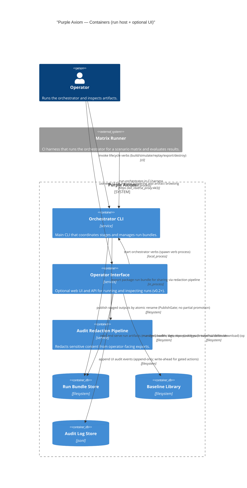

# Purple Axiom — C4 Container

```mermaid
C4Container
title "Purple Axiom — Containers (run host + optional UI)"
Person(operator, "Operator", "Runs the orchestrator and inspects artifacts.")
System_Ext(matrix_runner, "Matrix Runner", "CI harness that runs the orchestrator for a scenario matrix and evaluates results.")
System_Boundary(purple_ci_orchestrator, "Purple Axiom") {
  Container(orchestrator_cli, "Orchestrator CLI", "service", "Main CLI that coordinates stages and manages run bundles.")
  Container(operator_interface, "Operator Interface", "service", "Optional web UI and API for running and inspecting runs (v0.2+).")
  Container(audit_redactor, "Audit Redaction Pipeline", "service", "Redacts sensitive content from operator-facing exports.")
  ContainerDb(run_bundle_store, "Run Bundle Store", "filesystem", "")
  ContainerDb(baseline_library, "Baseline Library", "filesystem", "")
  ContainerDb(audit_log_store, "Audit Log Store", "jsonl", "")
}
Rel(operator, orchestrator_cli, "invoke lifecycle verbs (build/simulate/replay/export/destroy)", "cli")
Rel(operator, operator_interface, "use web UI for manual triggering and artifact browsing", "https (lan_reverse_proxy:443)")
Rel(operator_interface, orchestrator_cli, "start orchestrator verbs (spawn verb process)", "local_process")
Rel(operator_interface, run_bundle_store, "read and serve run artifacts (manifest, health, logs, report) with path traversal defenses", "filesystem")
Rel(operator_interface, audit_log_store, "append UI audit events (append-only; write-ahead for gated actions)", "filesystem")
Rel(operator_interface, baseline_library, "manage baseline detection packages (create/list/delete/download) (optional; v0.2+ when enabled)", "filesystem")
Rel(matrix_runner, orchestrator_cli, "run orchestrator in CI harness", "local_process")
Rel(orchestrator_cli, run_bundle_store, "publish staged outputs by atomic rename (PublishGate; no partial promotion)", "filesystem")
Rel(orchestrator_cli, audit_redactor, "export package run bundle for sharing via redaction pipeline", "in_process")
```
