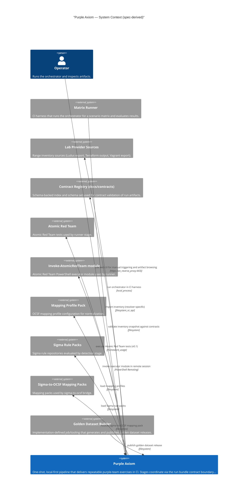

# Purple Axiom — C4 Context

```mermaid
C4Context
title "Purple Axiom — System Context (spec-derived)"
Person(operator, "Operator", "Runs the orchestrator and inspects artifacts.")
System_Ext(matrix_runner, "Matrix Runner", "CI harness that runs the orchestrator for a scenario matrix and evaluates results.")
System_Ext(lab_provider_sources, "Lab Provider Sources", "Range inventory sources (Ludus export, Terraform output, Vagrant export).")
System_Ext(contract_registry, "Contract Registry (docs/contracts)", "Schema-backed index and schema set used for contract validation of run artifacts.")
System_Ext(atomic_red_team, "Atomic Red Team", "Atomic Red Team tests used by runner stage.")
System_Ext(invoke_atomic_red_team, "Invoke-AtomicRedTeam module", "Atomic Red Team PowerShell executor module used by runner.")
System_Ext(mapping_profile_pack, "Mapping Profile Pack", "OCSF mapping profile configuration for normalization.")
System_Ext(sigma_rule_packs, "Sigma Rule Packs", "Sigma rule repositories evaluated by detection stage.")
System_Ext(sigma_to_ocsf_mapping_packs, "Sigma-to-OCSF Mapping Packs", "Mapping packs used by sigma-to-ocsf bridge.")
System_Ext(golden_dataset_builder, "Golden Dataset Builder", "Implementation-defined job/tooling that generates and publishes golden dataset releases.")
System(purple_ci_orchestrator, "Purple Axiom", "One-shot, local-first pipeline that delivers repeatable purple-team exercises in CI. Stages coordinate via the run bundle contract boundary…")
Rel(operator, purple_ci_orchestrator, "invoke lifecycle verbs (build/simulate/replay/export/destroy)", "cli")
Rel(operator, purple_ci_orchestrator, "use web UI for manual triggering and artifact browsing", "https (lan_reverse_proxy:443)")
Rel(matrix_runner, purple_ci_orchestrator, "run orchestrator in CI harness", "local_process")
Rel(purple_ci_orchestrator, lab_provider_sources, "import inventory (resolver-specific)", "filesystem_or_api")
Rel(purple_ci_orchestrator, contract_registry, "validate inventory snapshot against contracts", "filesystem")
Rel(purple_ci_orchestrator, atomic_red_team, "execute Atomic Red Team tests (v0.1)", "framework_usage")
Rel(purple_ci_orchestrator, invoke_atomic_red_team, "invoke executor module in remote session", "PowerShell Remoting")
Rel(purple_ci_orchestrator, mapping_profile_pack, "load mapping profiles", "filesystem")
Rel(purple_ci_orchestrator, sigma_rule_packs, "load Sigma rule packs", "filesystem")
Rel(purple_ci_orchestrator, sigma_to_ocsf_mapping_packs, "resolve Sigma-to-OCSF mapping pack", "filesystem")
Rel(golden_dataset_builder, purple_ci_orchestrator, "publish golden dataset release", "filesystem")
```
