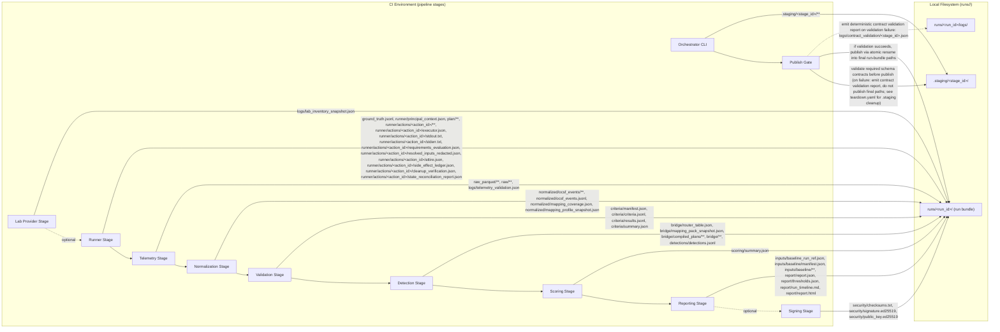

# Publish gate + contract seams

```mermaid
flowchart LR
  %% --- execution context ---
  subgraph ci_environment["CI Environment (pipeline stages)"]
    orchestrator_cli["Orchestrator CLI"]
    publish_gate["Publish Gate"]
    lab_provider["Lab Provider Stage"]
    runner["Runner Stage"]
    telemetry["Telemetry Stage"]
    normalization["Normalization Stage"]
    validation["Validation Stage"]
    detection["Detection Stage"]
    scoring["Scoring Stage"]
    reporting["Reporting Stage"]
    signing["Signing Stage"]
  end

  subgraph local_filesystem["Local Filesystem (runs/<run_id>/)"]
    staging_area[".staging/#lt;stage_id#gt;/"]
    run_bundle_store["runs/#lt;run_id#gt;/ (run bundle)"]
    run_logs_store["runs/#lt;run_id#gt;/logs/"]
  end

  %% --- canonical stage order ---
  lab_provider -. "optional" .-> runner
  runner --> telemetry
  telemetry --> normalization
  normalization --> validation
  validation --> detection
  detection --> scoring
  scoring --> reporting
  reporting -. "optional" .-> signing

  %% --- publish discipline (stage writes -> validate -> atomic promote) ---
  orchestrator_cli --> publish_gate
  orchestrator_cli -->|".staging/#lt;stage_id#gt;/**"| staging_area
  publish_gate -->|"validate required schema contracts before publish (on failure: emit contract validation report, do not publish final paths; see teardown.yaml for .staging cleanup)"| staging_area
  publish_gate -->|"if validation succeeds, publish via atomic rename into final run-bundle paths"| run_bundle_store
  publish_gate -.->|"emit deterministic contract validation report on validation failure: logs/contract_validation/#lt;stage_id#gt;.json"| run_logs_store

  %% --- contract seams: each stage owns a run-bundle write subtree ---
  lab_provider -->|"logs/lab_inventory_snapshot.json"| run_bundle_store
  runner -->|"ground_truth.jsonl, runner/principal_context.json, plan/**, runner/actions/#lt;action_id#gt;/**, runner/actions/#lt;action_id#gt;/executor.json, runner/actions/#lt;action_id#gt;/stdout.txt, runner/actions/#lt;action_id#gt;/stderr.txt, runner/actions/#lt;action_id#gt;/requirements_evaluation.json, runner/actions/#lt;action_id#gt;/resolved_inputs_redacted.json, runner/actions/#lt;action_id#gt;/attire.json, runner/actions/#lt;action_id#gt;/side_effect_ledger.json, runner/actions/#lt;action_id#gt;/cleanup_verification.json, runner/actions/#lt;action_id#gt;/state_reconciliation_report.json"| run_bundle_store
  telemetry -->|"raw_parquet/**, raw/**, logs/telemetry_validation.json"| run_bundle_store
  normalization -->|"normalized/ocsf_events/**, normalized/ocsf_events.jsonl, normalized/mapping_coverage.json, normalized/mapping_profile_snapshot.json"| run_bundle_store
  validation -->|"criteria/manifest.json, criteria/criteria.jsonl, criteria/results.jsonl, criteria/summary.json"| run_bundle_store
  detection -->|"bridge/router_table.json, bridge/mapping_pack_snapshot.json, bridge/compiled_plans/**, bridge/**, detections/detections.jsonl"| run_bundle_store
  scoring -->|"scoring/summary.json"| run_bundle_store
  reporting -->|"inputs/baseline_run_ref.json, inputs/baseline/manifest.json, inputs/baseline/**, report/report.json, report/thresholds.json, report/run_timeline.md, report/report.html"| run_bundle_store
  signing -->|"security/checksums.txt, security/signature.ed25519, security/public_key.ed25519"| run_bundle_store
```
