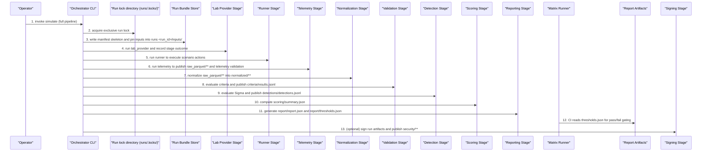

# Canonical run sequence (v0.1)

```mermaid
sequenceDiagram
  participant operator as "Operator"
  participant orchestrator_cli as "Orchestrator CLI"
  participant run_lock_dir as "Run lock directory (runs/.locks/)"
  participant run_bundle_store as "Run Bundle Store"
  participant lab_provider as "Lab Provider Stage"
  participant runner as "Runner Stage"
  participant telemetry as "Telemetry Stage"
  participant normalization as "Normalization Stage"
  participant validation as "Validation Stage"
  participant detection as "Detection Stage"
  participant scoring as "Scoring Stage"
  participant reporting as "Reporting Stage"
  participant matrix_runner as "Matrix Runner"
  participant report_artifacts as "Report Artifacts"
  participant signing as "Signing Stage"
  operator->>orchestrator_cli: 1. invoke simulate (full pipeline)
  orchestrator_cli->>run_lock_dir: 2. acquire exclusive run lock
  orchestrator_cli->>run_bundle_store: 3. write manifest skeleton and pin inputs into runs <run_id>/inputs/
  orchestrator_cli->>lab_provider: 4. run lab_provider and record stage outcome
  orchestrator_cli->>runner: 5. run runner to execute scenario actions
  orchestrator_cli->>telemetry: 6. run telemetry to publish raw_parquet/** and telemetry validation
  orchestrator_cli->>normalization: 7. normalize raw_parquet/** into normalized/**
  orchestrator_cli->>validation: 8. evaluate criteria and publish criteria/results.jsonl
  orchestrator_cli->>detection: 9. evaluate Sigma and publish detections/detections.jsonl
  orchestrator_cli->>scoring: 10. compute scoring/summary.json
  orchestrator_cli->>reporting: 11. generate report/report.json and report/thresholds.json
  matrix_runner->>report_artifacts: 12. CI reads thresholds.json for pass/fail gating
  orchestrator_cli->>signing: 13. (optional) sign run artifacts and publish security/**
```
