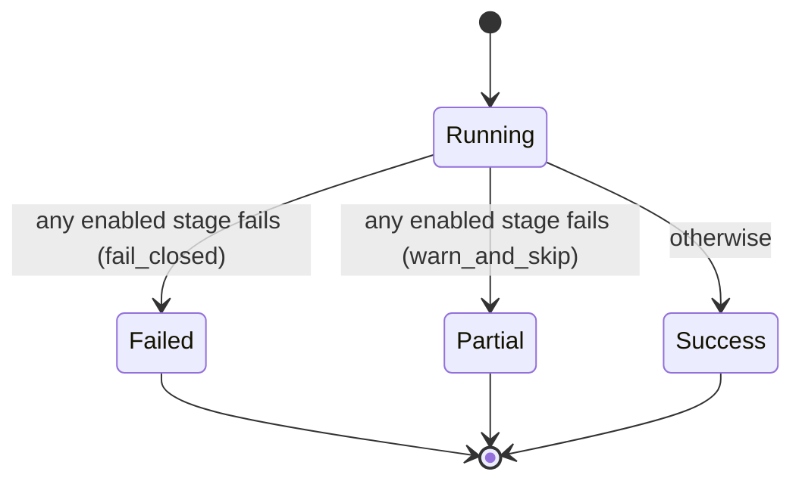

# Run status (success/partial/failed)

```mermaid
stateDiagram-v2
  [*] --> Running
  Running --> Failed: any enabled stage fails (fail_closed)
  Running --> Partial: any enabled stage fails (warn_and_skip)
  Running --> Success: otherwise
  Failed --> [*]
  Partial --> [*]
  Success --> [*]
```
