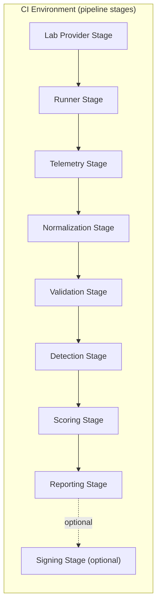

# Stage flow

```mermaid
flowchart LR
  subgraph ci_environment["CI Environment (pipeline stages)"]
    lab_provider["Lab Provider Stage"]
    runner["Runner Stage"]
    telemetry["Telemetry Stage"]
    normalization["Normalization Stage"]
    validation["Validation Stage"]
    detection["Detection Stage"]
    scoring["Scoring Stage"]
    reporting["Reporting Stage"]
    signing["Signing Stage (optional)"]
  end
  lab_provider --> runner
  runner --> telemetry
  telemetry --> normalization
  normalization --> validation
  validation --> detection
  detection --> scoring
  scoring --> reporting
  reporting -. "optional" .-> signing
```
