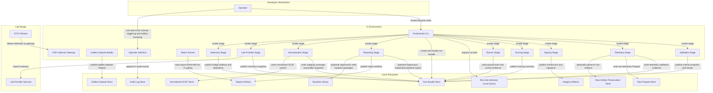

# Trust boundaries

```mermaid
flowchart TB
  subgraph developer_workstation["Developer Workstation"]
    operator["Operator"]
  end
  subgraph ci_environment["CI Environment"]
    detection["Detection Stage"]
    golden_dataset_builder["Golden Dataset Builder"]
    lab_provider["Lab Provider Stage"]
    matrix_runner["Matrix Runner"]
    normalization["Normalization Stage"]
    operator_interface["Operator Interface"]
    orchestrator_cli["Orchestrator CLI"]
    otel_collector_gateway["OTel Collector Gateway"]
    reporting["Reporting Stage"]
    runner["Runner Stage"]
    scoring["Scoring Stage"]
    signing["Signing Stage"]
    telemetry["Telemetry Stage"]
    validation["Validation Stage"]
  end
  subgraph lab_range["Lab Range"]
    lab_provider_sources["Lab Provider Sources"]
    otlp_stream["OTLP Stream"]
  end
  subgraph local_filesystem["Local Filesystem"]
    audit_log_store["Audit Log Store"]
    baseline_library["Baseline Library"]
    golden_dataset_store["Golden Dataset Store"]
    integrity_artifacts["Integrity Artifacts"]
    normalized_ocsf_store["Normalized OCSF Store"]
    raw_artifacts_store["Raw Artifact Preservation Store"]
    raw_parquet_store["Raw Parquet Store"]
    report_artifacts["Report Artifacts"]
    run_bundle_store["Run Bundle Store"]
    run_lock_dir["Run lock directory (runs/.locks/)"]
  end
  detection -->|publish bridge artifacts and detections| run_bundle_store
  golden_dataset_builder -->|publish golden dataset release| golden_dataset_store
  lab_provider -->|import inventory| lab_provider_sources
  lab_provider -->|publish inventory snapshot| run_bundle_store
  matrix_runner -->|read report thresholds for CI gating| report_artifacts
  normalization -->|write normalized OCSF events| normalized_ocsf_store
  normalization -->|write mapping coverage and profile snapshot| run_bundle_store
  operator -->|use web UI for manual triggering and artifact browsing| operator_interface
  operator -->|invoke lifecycle verbs| orchestrator_cli
  operator_interface -->|append UI audit events| audit_log_store
  orchestrator_cli -->|invoke stage| detection
  orchestrator_cli -->|invoke stage| lab_provider
  orchestrator_cli -->|invoke stage| normalization
  orchestrator_cli -->|invoke stage| reporting
  orchestrator_cli -->|create and mutate run bundle| run_bundle_store
  orchestrator_cli -->|acquire run lock| run_lock_dir
  orchestrator_cli -->|invoke stage| runner
  orchestrator_cli -->|invoke stage| scoring
  orchestrator_cli -->|invoke stage| signing
  orchestrator_cli -->|invoke stage| telemetry
  orchestrator_cli -->|invoke stage| validation
  otlp_stream -->|deliver telemetry to gateway| otel_collector_gateway
  reporting -->|"(optional regression) read baseline packages"| baseline_library
  reporting -->|publish report artifacts| report_artifacts
  reporting -->|"(optional regression) materialize baseline inputs"| run_bundle_store
  runner -->|write ground truth and runner evidence| run_bundle_store
  scoring -->|publish scoring summary| run_bundle_store
  signing -->|publish checksums and signature| integrity_artifacts
  telemetry -->|optionally preserve raw artifacts| raw_artifacts_store
  telemetry -->|write raw telemetry Parquet| raw_parquet_store
  telemetry -->|write telemetry validation evidence| run_bundle_store
  validation -->|publish criteria snapshot and results| run_bundle_store
```
