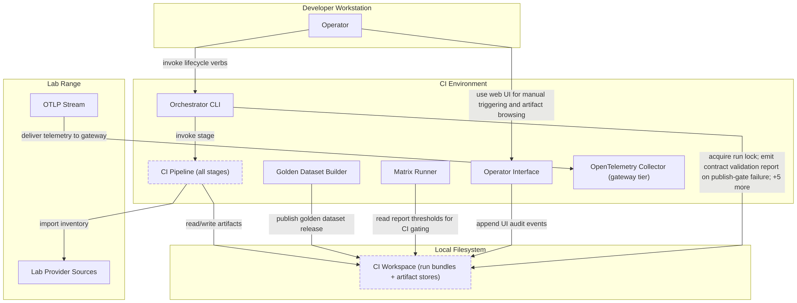

# Trust boundaries

```mermaid
%%{init: {"flowchart": {"curve":"linear", "useMaxWidth": false}} }%%
flowchart TB
  subgraph developer_workstation["Developer Workstation"]
    direction TB
    operator["Operator"]
  end
  subgraph ci_environment["CI Environment"]
    direction TB
    agg_ci_pipeline["CI Pipeline (all stages)"]
    golden_dataset_builder["Golden Dataset Builder"]
    matrix_runner["Matrix Runner"]
    operator_interface["Operator Interface"]
    orchestrator_cli["Orchestrator CLI"]
    otel_collector_gateway["OpenTelemetry Collector (gateway tier)"]
  end
  subgraph lab_range["Lab Range"]
    direction TB
    lab_provider_sources["Lab Provider Sources"]
    otlp_stream["OTLP Stream"]
  end
  subgraph local_filesystem["Local Filesystem"]
    direction TB
    agg_ci_workspace["CI Workspace (run bundles + artifact stores)"]
  end
  agg_ci_pipeline -->|read/write artifacts| agg_ci_workspace
  agg_ci_pipeline -->|import inventory| lab_provider_sources
  golden_dataset_builder -->|publish golden dataset release| agg_ci_workspace
  matrix_runner -->|read report thresholds for CI gating| agg_ci_workspace
  operator -->|use web UI for manual triggering and artifact browsing| operator_interface
  operator -->|invoke lifecycle verbs| orchestrator_cli
  operator_interface -->|append UI audit events| agg_ci_workspace
  orchestrator_cli -->|invoke stage| agg_ci_pipeline
  orchestrator_cli -->|acquire run lock; emit contract validation report on publish-gate failure; +5 more| agg_ci_workspace
  otlp_stream -->|deliver telemetry to gateway| otel_collector_gateway
  classDef aggregate stroke-dasharray: 6 3
  class agg_ci_pipeline,agg_ci_workspace aggregate
```
