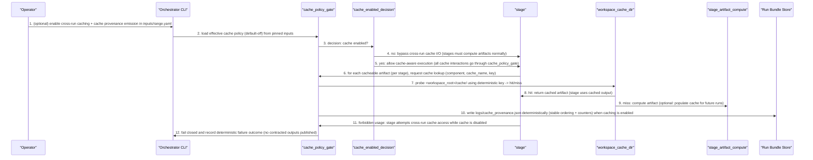

# Run sequence — Cross-run caching gate + cache provenance (cache_provenance)

```mermaid
sequenceDiagram
  participant operator as "Operator"
  participant orchestrator_cli as "Orchestrator CLI"
  participant cache_policy_gate as "cache_policy_gate"
  participant cache_enabled_decision as "cache_enabled_decision"
  participant stage as "stage"
  participant workspace_cache_dir as "workspace_cache_dir"
  participant stage_artifact_compute as "stage_artifact_compute"
  participant run_bundle_store as "Run Bundle Store"
  operator->>orchestrator_cli: 1. (optional) enable cross-run caching + cache provenance emission in inputs/range.yaml
  orchestrator_cli->>cache_policy_gate: 2. load effective cache policy (default-off) from pinned inputs
  cache_policy_gate->>cache_enabled_decision: 3. decision: cache enabled?
  cache_enabled_decision->>stage: 4. no: bypass cross-run cache I/O (stages must compute artifacts normally)
  cache_enabled_decision->>stage: 5. yes: allow cache-aware execution (all cache interactions go through cache_policy_gate)
  stage->>cache_policy_gate: 6. for each cacheable artifact (per stage), request cache lookup (component, cache_name, key)
  cache_policy_gate->>workspace_cache_dir: 7. probe #lt;workspace_root#gt;/cache/ using deterministic key -#gt; hit/miss
  workspace_cache_dir->>stage: 8. hit: return cached artifact (stage uses cached output)
  workspace_cache_dir->>stage_artifact_compute: 9. miss: compute artifact (optional: populate cache for future runs)
  cache_policy_gate->>run_bundle_store: 10. write logs/cache_provenance.json deterministically (stable ordering + counters) when caching is enabled
  stage->>cache_policy_gate: 11. forbidden usage: stage attempts cross-run cache access while cache is disabled
  cache_policy_gate->>orchestrator_cli: 12. fail closed and record deterministic failure outcome (no contracted outputs published)
```
