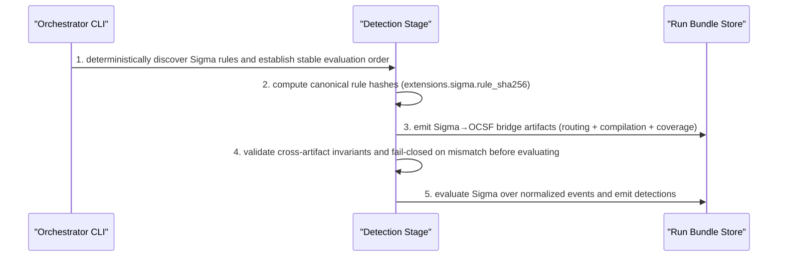

# Run sequence — Detection pipeline (Sigma) - deterministic load + bridge + detections (detection_sigma_pipeline)

```mermaid
sequenceDiagram
  participant orchestrator_cli as "Orchestrator CLI"
  participant detection as "Detection Stage"
  participant run_bundle_store as "Run Bundle Store"
  orchestrator_cli->>detection: 1. deterministically discover Sigma rules and establish stable evaluation order
  detection->>detection: 2. compute canonical rule hashes (extensions.sigma.rule_sha256)
  detection->>run_bundle_store: 3. emit Sigma→OCSF bridge artifacts (routing + compilation + coverage)
  detection->>detection: 4. validate cross-artifact invariants and fail-closed on mismatch before evaluating
  detection->>run_bundle_store: 5. evaluate Sigma over normalized events and emit detections
```
