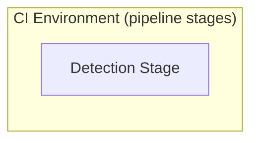

# Stage flow — Detection pipeline (Sigma) - deterministic load + bridge + detections (detection_sigma_pipeline)

```mermaid
flowchart LR
  subgraph ci_environment["CI Environment (pipeline stages)"]
    detection["Detection Stage"]
  end
```
