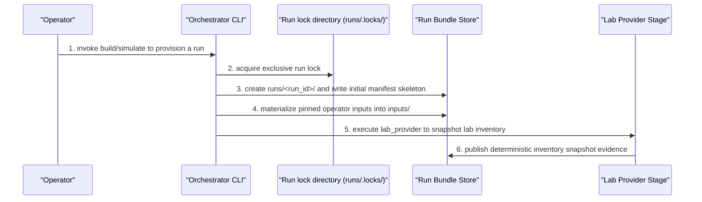

# Run sequence — Provisioning and environment bring-up (provisioning)

```mermaid
sequenceDiagram
  participant operator as "Operator"
  participant orchestrator_cli as "Orchestrator CLI"
  participant run_lock_dir as "Run lock directory (runs/.locks/)"
  participant run_bundle_store as "Run Bundle Store"
  participant lab_provider as "Lab Provider Stage"
  operator->>orchestrator_cli: 1. invoke build/simulate to provision a run
  orchestrator_cli->>run_lock_dir: 2. acquire exclusive run lock
  orchestrator_cli->>run_bundle_store: 3. create runs/#lt;run_id#gt;/ and write initial manifest skeleton
  orchestrator_cli->>run_bundle_store: 4. materialize pinned operator inputs into inputs/
  orchestrator_cli->>lab_provider: 5. execute lab_provider to snapshot lab inventory
  lab_provider->>run_bundle_store: 6. publish deterministic inventory snapshot evidence
```
