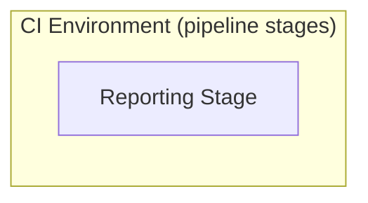

# Stage flow — Reporting regression compare (baseline vs candidate) (reporting_regression_compare)

```mermaid
flowchart LR
  subgraph ci_environment["CI Environment (pipeline stages)"]
    reporting["Reporting Stage"]
  end
```
