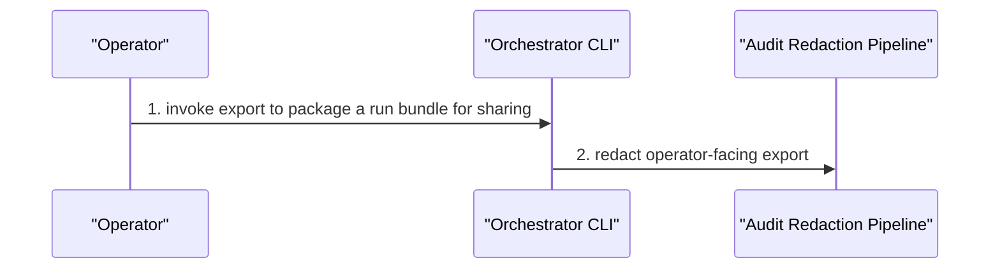

# Run sequence — Export (redaction-safe bundle) (run_export)

```mermaid
sequenceDiagram
  participant operator as "Operator"
  participant orchestrator_cli as "Orchestrator CLI"
  participant audit_redactor as "Audit Redaction Pipeline"
  operator->>orchestrator_cli: 1. invoke export to package a run bundle for sharing
  orchestrator_cli->>audit_redactor: 2. redact operator-facing export
```
