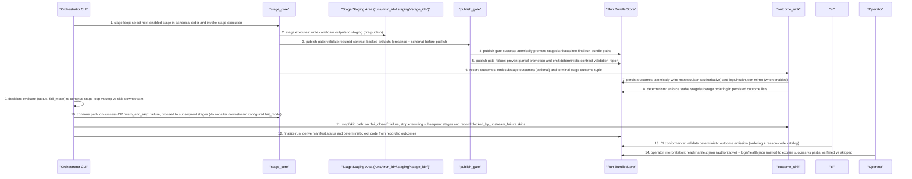

# Run sequence — Run lifecycle and outcome propagation (state-machine oriented) (run_lifecycle_outcome_propagation)

```mermaid
sequenceDiagram
  participant orchestrator_cli as "Orchestrator CLI"
  participant stage_core as "stage_core"
  participant staging_area as "Stage Staging Area (runs/#lt;run_id#gt;/.staging/#lt;stage_id#gt;/)"
  participant publish_gate as "publish_gate"
  participant run_bundle_store as "Run Bundle Store"
  participant outcome_sink as "outcome_sink"
  participant ci as "ci"
  participant operator as "Operator"
  orchestrator_cli->>stage_core: 1. stage loop: select next enabled stage in canonical order and invoke stage execution
  stage_core->>staging_area: 2. stage executes: write candidate outputs to staging (pre-publish)
  stage_core->>publish_gate: 3. publish gate: validate required contract-backed artifacts (presence + schema) before publish
  publish_gate->>run_bundle_store: 4. publish gate success: atomically promote staged artifacts into final run-bundle paths
  publish_gate->>run_bundle_store: 5. publish gate failure: prevent partial promotion and emit deterministic contract validation report
  stage_core->>outcome_sink: 6. record outcomes: emit substage outcomes (optional) and terminal stage outcome tuple
  outcome_sink->>run_bundle_store: 7. persist outcomes: atomically write manifest.json (authoritative) and logs/health.json mirror (when enabled)
  outcome_sink->>run_bundle_store: 8. determinism: enforce stable stage/substage ordering in persisted outcome lists
  orchestrator_cli->>orchestrator_cli: 9. decision: evaluate (status, fail_mode) to continue stage loop vs stop vs skip downstream
  orchestrator_cli->>stage_core: 10. continue path: on success OR `warn_and_skip` failure, proceed to subsequent stages (do not alter downstream configured fail_mode)
  orchestrator_cli->>outcome_sink: 11. stop/skip path: on `fail_closed` failure, stop executing subsequent stages and record blocked_by_upstream_failure skips
  orchestrator_cli->>run_bundle_store: 12. finalize run: derive manifest.status and deterministic exit code from recorded outcomes
  ci->>run_bundle_store: 13. CI conformance: validate deterministic outcome emission (ordering + reason-code catalog)
  operator->>run_bundle_store: 14. operator interpretation: read manifest.json (authoritative) + logs/health.json (mirror) to explain success vs partial vs failed vs skipped
```
