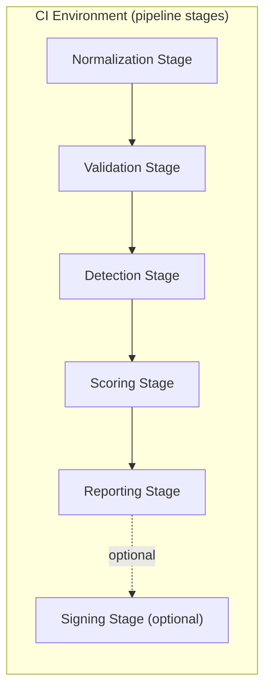

# Stage flow — Replay (analysis-only) (run_replay)

```mermaid
flowchart LR
  subgraph ci_environment["CI Environment (pipeline stages)"]
    normalization["Normalization Stage"]
    validation["Validation Stage"]
    detection["Detection Stage"]
    scoring["Scoring Stage"]
    reporting["Reporting Stage"]
    signing["Signing Stage (optional)"]
  end
  normalization --> validation
  validation --> detection
  detection --> scoring
  scoring --> reporting
  reporting -. "optional" .-> signing
```
