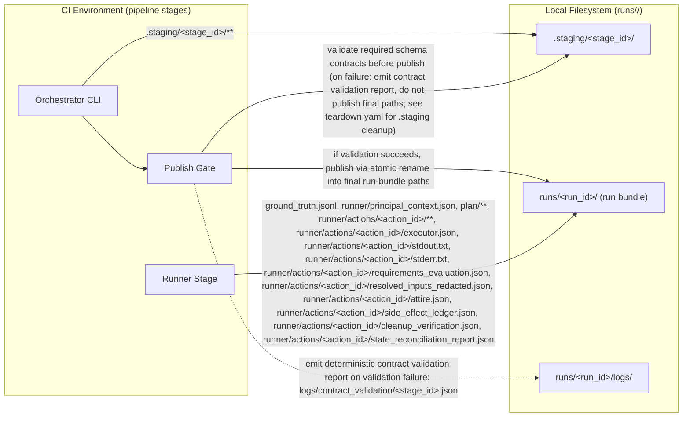

# Publish gate + contract seams — Runner action lifecycle (prepare → execute → revert → teardown) (runner_action_lifecycle)

```mermaid
flowchart LR
  %% --- execution context ---
  subgraph ci_environment["CI Environment (pipeline stages)"]
    orchestrator_cli["Orchestrator CLI"]
    publish_gate["Publish Gate"]
    runner["Runner Stage"]
  end

  subgraph local_filesystem["Local Filesystem (runs/<run_id>/)"]
    staging_area[".staging/#lt;stage_id#gt;/"]
    run_bundle_store["runs/#lt;run_id#gt;/ (run bundle)"]
    run_logs_store["runs/#lt;run_id#gt;/logs/"]
  end

  %% --- canonical stage order ---

  %% --- publish discipline (stage writes -> validate -> atomic promote) ---
  orchestrator_cli --> publish_gate
  orchestrator_cli -->|".staging/#lt;stage_id#gt;/**"| staging_area
  publish_gate -->|"validate required schema contracts before publish (on failure: emit contract validation report, do not publish final paths; see teardown.yaml for .staging cleanup)"| staging_area
  publish_gate -->|"if validation succeeds, publish via atomic rename into final run-bundle paths"| run_bundle_store
  publish_gate -.->|"emit deterministic contract validation report on validation failure: logs/contract_validation/#lt;stage_id#gt;.json"| run_logs_store

  %% --- contract seams: each stage owns a run-bundle write subtree ---
  runner -->|"ground_truth.jsonl, runner/principal_context.json, plan/**, runner/actions/#lt;action_id#gt;/**, runner/actions/#lt;action_id#gt;/executor.json, runner/actions/#lt;action_id#gt;/stdout.txt, runner/actions/#lt;action_id#gt;/stderr.txt, runner/actions/#lt;action_id#gt;/requirements_evaluation.json, runner/actions/#lt;action_id#gt;/resolved_inputs_redacted.json, runner/actions/#lt;action_id#gt;/attire.json, runner/actions/#lt;action_id#gt;/side_effect_ledger.json, runner/actions/#lt;action_id#gt;/cleanup_verification.json, runner/actions/#lt;action_id#gt;/state_reconciliation_report.json"| run_bundle_store
```
