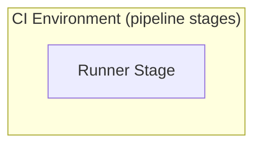

# Stage flow — Runner action lifecycle (prepare → execute → revert → teardown) (runner_action_lifecycle)

```mermaid
flowchart LR
  subgraph ci_environment["CI Environment (pipeline stages)"]
    runner["Runner Stage"]
  end
```
