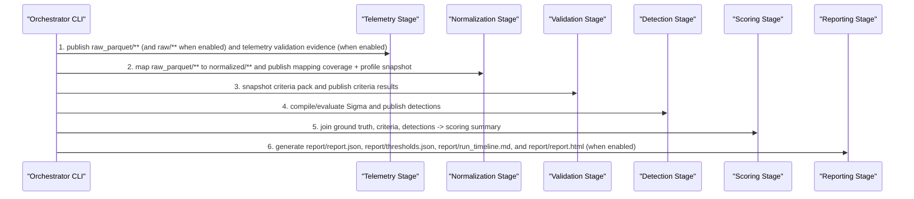

# Run sequence — Telemetry ingest to scoring and reporting (scoring_reporting)

```mermaid
sequenceDiagram
  participant orchestrator_cli as "Orchestrator CLI"
  participant telemetry as "Telemetry Stage"
  participant normalization as "Normalization Stage"
  participant validation as "Validation Stage"
  participant detection as "Detection Stage"
  participant scoring as "Scoring Stage"
  participant reporting as "Reporting Stage"
  orchestrator_cli->>telemetry: 1. publish raw_parquet/** (and raw/** when enabled) and telemetry validation evidence (when enabled)
  orchestrator_cli->>normalization: 2. map raw_parquet/** to normalized/** and publish mapping coverage + profile snapshot
  orchestrator_cli->>validation: 3. snapshot criteria pack and publish criteria results
  orchestrator_cli->>detection: 4. compile/evaluate Sigma and publish detections
  orchestrator_cli->>scoring: 5. join ground truth, criteria, detections -#gt; scoring summary
  orchestrator_cli->>reporting: 6. generate report/report.json, report/thresholds.json, report/run_timeline.md, and report/report.html (when enabled)
```
