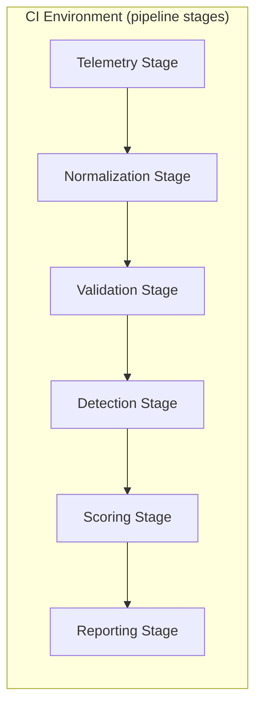

# Stage flow — Telemetry ingest to scoring and reporting (scoring_reporting)

```mermaid
flowchart LR
  subgraph ci_environment["CI Environment (pipeline stages)"]
    telemetry["Telemetry Stage"]
    normalization["Normalization Stage"]
    validation["Validation Stage"]
    detection["Detection Stage"]
    scoring["Scoring Stage"]
    reporting["Reporting Stage"]
  end
  telemetry --> normalization
  normalization --> validation
  validation --> detection
  detection --> scoring
  scoring --> reporting
```
