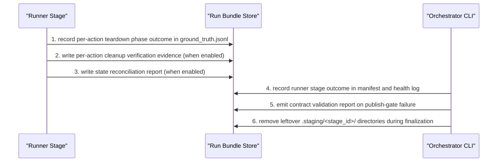

# Run sequence — Runner teardown and cleanup evidence (teardown)

```mermaid
sequenceDiagram
  participant runner as "Runner Stage"
  participant run_bundle_store as "Run Bundle Store"
  participant orchestrator_cli as "Orchestrator CLI"
  runner->>run_bundle_store: 1. record per-action teardown phase outcome in ground_truth.jsonl
  runner->>run_bundle_store: 2. write per-action cleanup verification evidence (when enabled)
  runner->>run_bundle_store: 3. write state reconciliation report (when enabled)
  orchestrator_cli->>run_bundle_store: 4. record runner stage outcome in manifest and health log
  orchestrator_cli->>run_bundle_store: 5. emit contract validation report on publish-gate failure
  orchestrator_cli->>run_bundle_store: 6. remove leftover .staging/#lt;stage_id#gt;/ directories during finalization
```
