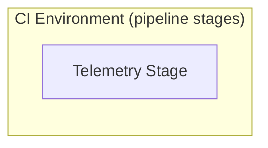

# Stage flow — Telemetry validation canaries (egress + checkpoint integrity) (telemetry_validation_canaries)

```mermaid
flowchart LR
  subgraph ci_environment["CI Environment (pipeline stages)"]
    telemetry["Telemetry Stage"]
  end
```
